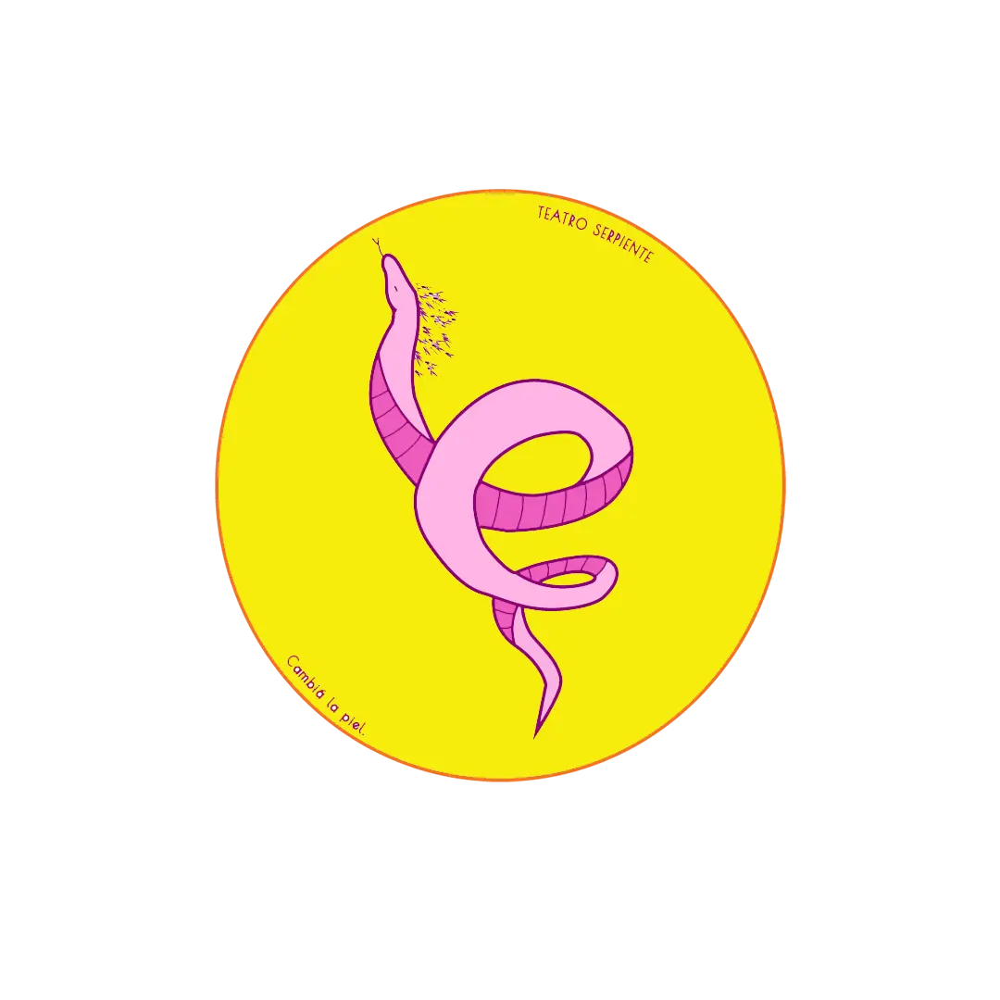

 
  

[Reportar error](https://github.com/ChortJulio/TeatroSerpiente/issues) · [Ver Instagram](https://www.instagram.com/teatroserpiente/)

# Teatro Serpiente - Landing Page

> ¡Cambiá la piel!

Este repositorio contiene el código fuente de la landing page de **Teatro Serpiente**, un teatro independiente de la ciudad de Santa Fe.

## 🎭 Actuación para jóvenes, adolescentes y pre-adolescentes

**Teatro Serpiente** es un espacio de creación y formación teatral que se dedica a la producción de espectáculos para jóvenes, adolescentes y pre-adolescentes. La propuesta artística de **Teatro Serpiente** se caracteriza por la búsqueda de un lenguaje propio y la experimentación con distintas formas de narración.

## 🫂 Contribuidores

## 📚 Directora del teatro

- **Lic.** Chort, Nicole
